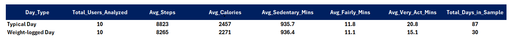
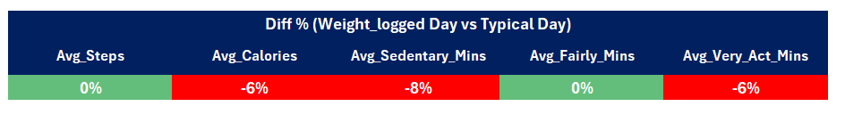
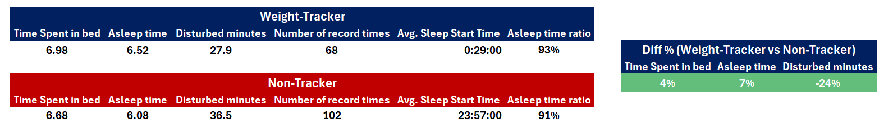

# Bellabeat Smart Device Analysis
### Google Data Analytics Capstone Project
**Data Source:** FitBit Fitness Tracker Data (Kaggle, CC0 Public Domain)  
**Tools Used:** Google BigQuery (SQL)

---

# Phase 1: Ask

This phase defines the business problem, identifies the stakeholders, and establishes the analytical direction for the project.

## 1.1 Summary of the Business Task

Bellabeat is a high-tech company that manufactures health-focused smart products for women. The company's co-founder and Chief Creative Officer, Urška Sršen, believes that analyzing smart device fitness data could unlock new growth opportunities. The goal of this analysis is to examine how consumers use non-Bellabeat smart devices in order to identify behavioral trends that can be applied to one of Bellabeat's products and inform the company's marketing strategy.

**Key Business Questions:**
- What are some trends in smart device usage?
- How could these trends apply to Bellabeat customers?
- How could these trends help influence Bellabeat's marketing strategy?

## 1.2 Key Stakeholders

- **Urška Sršen** — Co-founder and Chief Creative Officer. Primary sponsor of this analysis.
- **Sando Mur** — Co-founder and mathematician. Key member of the executive team.
- **Bellabeat Marketing Analytics Team** — Will act on the findings and recommendations produced by this analysis.

---

# Phase 2: Prepare

This phase covers data sourcing, storage, organization, credibility assessment, and ethical considerations.

## 2.1 Data Source

- **Dataset:** FitBit Fitness Tracker Data (CC0 Public Domain, available via Kaggle, submitted by Mobius).
- **Content:** Personal fitness tracker data from 33 Fitbit users who consented to the submission of their data. Includes minute-level output for physical activity, heart rate, and sleep monitoring.
- **Format:** 11 CSV files used in this analysis, organized in both long and wide formats depending on the table.

## 2.2 Data Storage

The dataset was uploaded to Google BigQuery under a dedicated project (`capstone-project-475109`), organized within a dataset named `Fitabase_Data`. All 11 CSV files were stored as individual tables, enabling SQL-based querying and cross-table analysis at scale.

## 2.3 Data Organization

The dataset contains both long and wide format tables. The Daily Activity table is structured in **wide format**, with each row representing a single user-day and multiple metrics captured as separate columns. The minute-level and hourly tables (e.g., Minute_Sleep, Hourly_Calories, Heartrate_Seconds) are structured in **long format**, with each row representing a single time-stamped observation per user. This distinction was accounted for during the cleaning phase, where appropriate aggregation strategies were applied per table type.

## 2.4 Credibility Assessment — ROCCC Framework

| Dimension | Rating | Assessment |
|---|---|---|
| Reliable | ⚠️ Low | Sample size of 33 users is insufficient for statistically significant conclusions. Results should be treated as directional. |
| Original | ✅ Yes | Data collected directly from Fitbit devices via Amazon Mechanical Turk survey. First-party dataset. |
| Comprehensive | 🟡 Moderate | Covers steps, calories, heart rate, sleep, and weight. Lacks demographic data (age, gender, location). |
| Current | ⚠️ Low | Collected in 2016. Consumer behavior and device capabilities have evolved significantly since then. |
| Cited | ✅ Yes | Publicly available under CC0 Public Domain license via Kaggle, submitted by Mobius. |

## 2.5 Licensing, Privacy & Security

The dataset is released under a CC0 Public Domain license, meaning no copyright restrictions apply and it can be freely used for analytical purposes. All user identifiers in the dataset are anonymized numeric IDs — no personally identifiable information (PII) such as names, emails, or locations is present. Data was stored in a private Google BigQuery project with access restricted to the analyst. No raw data files were shared or published externally.

## 2.6 Known Limitations

- The sample size of 33 users limits statistical generalizability. Findings should be treated as directional rather than definitive.
- The absence of demographic data — particularly gender — prevents direct confirmation of user profile hypotheses surfaced in the analysis.
- The 2016 collection date means findings may not fully reflect current consumer behavior. These limitations are acknowledged throughout the analysis and factored into the confidence level assigned to each recommendation.

---

# Phase 3: Process

This phase documents all data cleaning, transformation, and validation steps performed to ensure data integrity prior to analysis. All processing was performed using Google BigQuery (SQL).

## 3.1 Tool Selection

Google BigQuery was selected as the primary processing tool due to the scale and granularity of the dataset. Minute-level tables contain millions of rows, making a spreadsheet-based approach impractical for data processing. BigQuery's SQL environment enables reproducible, auditable transformations through views, which also serve as living documentation of the cleaning logic applied to each table.

Microsoft Excel was used as the visualization and presentation layer. Once the cleaned views were finalized in BigQuery, aggregated query outputs were exported to Excel for dashboard creation, chart design, and final visual presentation of findings.

## 3.2 Initial Inspection

- **Schema Review:** Conducted a schema review across all 11 tables to verify column names, data types, and structural consistency before any transformations were applied.

- **Duplicate & Collision Audit (Cross-Table Scan):** Prior to any table-level cleaning, a unified audit query was executed across all 11 tables using `UNION ALL`. For each table, total row counts were compared against the count of distinct composite keys — constructed by concatenating `Id` and the relevant timestamp column with a double-ampersand (`&&`) separator. The double-ampersand was deliberately chosen over a single `&` to eliminate collision risk between Id and timestamp string fragments. This scan confirmed that duplicate records were isolated exclusively to the `Minute_Sleep` table (525 records), while all remaining tables returned matching total and unique counts, validating their integrity before view creation.

- **Null Value Audit:** A column-level null check was performed on each table using `COUNTIF(column IS NULL)` across all relevant fields. The Daily Activity table served as the most comprehensive example of this approach, covering 15 distinct columns including steps, distance breakdowns, active minutes, and calories. This audit confirmed that null values were isolated exclusively to the `fat` column in the `Weight_Log` table (31 records). All other fields across all tables were found to be complete, requiring no imputation or row exclusion beyond the `fat` column.

## 3.3 Error Type Checklist

| Error Type | Status | Applied Technique |
|---|---|---|
| Duplicates | ✅ Done | SELECT DISTINCT within CTE (Minute Sleep); validated via cross-table scan for all others |
| Trailing Spaces | ✅ Done | TRIM() applied to Id and all timestamp columns |
| Format Errors | ✅ Done | PARSE_DATETIME() converting string timestamps to DATETIME |
| Null Values | ✅ Done | All columns clean except fat column in Weight Log (31 nulls) — retained with documentation |
| Logic Errors | ✅ Done | Valid Day filter: ≥2,000 steps, ≥1,200 calories, ≤1,380 sedentary minutes |
| Collision Risk | ✅ Done | Double-ampersand (&&) separator used in CONCAT for composite key construction |

525 duplicate records were identified and removed from the `Minute_Sleep` table. 31 null records were found in the `fat` column of the `Weight_Log` table and retained with documentation.

## 3.4 Table-Level Cleaning Documentation

### 1. Daily Activity Table

- **Validation Thresholds:** Data quality was ensured by establishing a "Valid Day" criteria. Records with fewer than 2,000 steps, less than 1,200 calories, and more than 1,380 sedentary minutes were excluded, as these values typically indicate non-wear time or device sync issues rather than actual user behavior.
- **Null Management:** Verified key metrics (Steps, Calories, Active Minutes) for completeness. No critical null values were found after applying the activity thresholds.
- **Conversion:** ID data converted to STRING for consistent joins across all tables.

### 2. Hourly Calories Table

- **Completeness Check (24-Hour Rule):** Only days with a full 24-hour cycle of recordings were included. This prevented hourly averages from being skewed by days with partial data (e.g., a device being charged for half a day).
- **Relational Integrity:** An INNER JOIN was performed with the cleaned Daily Activity table to ensure hourly analysis only reflects valid activity days.
- **Data Type Correction:** Converted timestamp strings into standardized DATETIME formats to enable precise hourly extraction and time-series analysis.

### 3. Hourly Intensities Table

- **Completeness Check (24-Hour Rule):** Only days with a full 24-hour cycle of recordings were included. This ensured that intensity averages accurately reflect complete daily activity patterns, preventing distortions caused by partial recording days.
- **Relational Integrity:** An INNER JOIN was performed with the cleaned Daily Activity table to guarantee that hourly intensity records correspond exclusively to validated activity days. Any records belonging to days that failed the activity thresholds were automatically excluded.
- **Metric Retention:** Both `Total_Intensity` and `Average_Intensity` fields were preserved — total intensity captures overall exertion volume per hour, while average intensity allows fair comparison across users with different recording frequencies.
- **Data Type Correction:** Converted the `Activity_Hour` timestamp strings into standardized DATETIME formats, with hour-of-day extracted as a separate integer field.

### 4. Hourly Steps Table

- **Completeness Check (24-Hour Rule):** Only days with a full 24-hour cycle of recordings were included to ensure step distributions reflect genuine activity patterns.
- **Relational Integrity:** An INNER JOIN was performed with the cleaned Daily Activity table. Any step records from days that failed the minimum threshold criteria were automatically excluded.
- **Metric Retention:** The `Steps` field was preserved at the hourly grain to enable time-of-day analysis, allowing identification of peak movement windows and sedentary hours.
- **Data Type Correction:** Converted the `Activity_hour` timestamp strings into standardized DATETIME formats, with hour-of-day extracted as a separate integer field.

### 5. Heartrate Seconds Table

- **Completeness Check (Valid Days Only):** Only records belonging to days that passed the Daily Activity validation thresholds were retained. Given second-level granularity, partial days could severely skew resting and peak heart rate calculations.
- **Relational Integrity:** An INNER JOIN was performed with the cleaned Daily Activity table to anchor all heart rate readings to validated activity days, preventing non-wear readings from contaminating the analysis.
- **Granularity Preservation:** The full `heartrate_time` timestamp was retained at second-level precision to enable fine-grained analyses such as identifying peak heart rate moments and heart rate recovery speed.
- **Dual Time Reference:** Both the full `heartrate_time` field and an extracted `hour_of_day` integer were included to support both granular and hourly aggregations within the same view.
- **Data Type Correction:** Converted the `Time` timestamp strings into standardized DATETIME formats. The `Value` field was renamed to `heart_rate` for readability and semantic clarity.

### 6. Minute Calories Table

- **Completeness Check (Valid Days Only):** Only records belonging to validated activity days were retained. Partial days could introduce disproportionate gaps in caloric burn patterns at minute-level granularity.
- **Relational Integrity:** An INNER JOIN was performed with the cleaned Daily Activity table. Records from days that failed thresholds were automatically excluded.
- **Granularity Aggregation:** The `hour_of_day` field was extracted to enable flexible aggregation supporting both minute-level and hourly caloric burn analyses within the same view.
- **Data Type Correction:** Converted the `Activity_Minute` timestamp strings into standardized DATETIME formats, with `activity_date` and `hour_of_day` derived as separate fields.

### 7. Minute Intensities Table

- **Completeness Check (Valid Days Only):** Only validated activity days were retained. Incomplete days could distort the distribution of low, moderate, and high intensity periods throughout the day.
- **Relational Integrity:** An INNER JOIN was performed with the cleaned Daily Activity table to ensure all minute-level intensity records are tied exclusively to validated days.
- **Metric Retention:** The `Intensity` field was preserved at the minute grain to enable classification of activity levels, identification of sustained high-intensity intervals, and intensity zone transition analysis.
- **Granularity Aggregation:** The `hour_of_day` field was extracted to support both minute-level and hourly intensity summaries.
- **Data Type Correction:** Converted the `Activity_Minute` timestamp strings into standardized DATETIME formats.

### 8. Minute Sleep Table

- **Duplicate Removal:** Unlike other tables, the Minute Sleep table required an explicit deduplication step. A `SELECT DISTINCT` was applied within a CTE (`unique_sleep`) to eliminate the 525 duplicate records identified during the initial audit. This step was performed first to ensure all downstream operations were conducted on a clean, unique dataset.
- **Completeness Check (Valid Days Only):** Only sleep records belonging to validated activity days were retained, enabling meaningful correlations between sleep quality and daily movement behavior.
- **Relational Integrity:** An INNER JOIN was performed with the cleaned Daily Activity table to anchor all minute-level sleep records to validated days.
- **Granularity Preservation:** The full `sleep_time` timestamp was retained at minute-level precision alongside the extracted `hour_of_day` field, supporting both granular analyses (sleep onset and wake-up time detection) and hourly distributions.
- **Metric Retention:** Both `sleep_state` and `logId` fields were preserved. The `sleep_state` field enables sleep stage classification per minute, while `logId` allows individual sleep sessions to be tracked and grouped independently.
- **Data Type Correction:** Converted the `Activity_Minute` timestamp strings into standardized DATETIME formats at the CTE level.

### 9. Minute Steps Table

- **Completeness Check (Valid Days Only):** Only validated activity days were retained. Incomplete days could introduce misleading gaps in movement patterns at minute-level granularity.
- **Relational Integrity:** An INNER JOIN was performed with the cleaned Daily Activity table. Records from days that failed thresholds were automatically excluded.
- **Metric Retention:** The `Steps` field was preserved at the minute grain to enable identification of burst activity periods, sustained walking intervals, and transitions between active and sedentary minutes.
- **Granularity Aggregation:** The `hour_of_day` field was extracted to support both minute-level and hourly step distribution summaries.
- **Data Type Correction:** Converted the `Activity_Minute` timestamp strings into standardized DATETIME formats.

### 10. Weight Log Table

- **User-Level Filtering:** Unlike other tables that join on both `Id` and `activity_date`, the Weight Log table was filtered at the user level only. A `WHERE IN` subquery was applied to retain records belonging to users present in the cleaned Daily Activity table. This approach was preferred because weight measurements are infrequent and may not coincide with a tracked activity day — a date-level INNER JOIN would have unnecessarily eliminated valid weight records.
- **Null Management:** The `fat` column contains 31 null records. Rather than excluding these rows entirely, the field was retained to preserve all other valid metrics (BMI, weight) for those users. Downstream analyses involving the `fat` field should account for its incompleteness accordingly.
- **Metric Retention:** All key body composition fields — `Weight_kg`, `Weight_pounds`, `fat`, `BMI` — were preserved. The `is_manual_report` flag was retained to allow differentiation between automatically synced and manually entered records.
- **Session Tracking:** The `LogId` field was preserved to enable individual weigh-in sessions to be uniquely identified and grouped.
- **Data Type Correction:** Converted the `Date` timestamp strings into standardized DATE formats.

### 11. Minute MET Table

- **Completeness Check (Valid Days Only):** Only validated activity days were retained. Incomplete days could significantly distort metabolic intensity profiles at minute-level granularity.
- **Relational Integrity:** An INNER JOIN was performed with the cleaned Daily Activity table to ensure all minute-level MET records are tied to validated days.
- **Metric Retention:** The `METs` field was preserved at the minute grain. MET values provide a standardized, body-weight-independent measure of energy expenditure, making this table particularly valuable for comparing activity intensity across users with different physical profiles.
- **Granularity Aggregation:** The `hour_of_day` field was extracted to support both minute-level and hourly metabolic intensity summaries.
- **Data Type Correction:** Converted the `Activity_Minute` timestamp strings into standardized DATETIME formats.

---

# Phase 4: Analyze

This phase documents the analytical approach, key findings, trends, and how the insights connect to the original business questions.

**How should you organize your data to perform analysis on it?**

Data was organized into two behavioral segments throughout the analysis: **Weight-Trackers** (users who logged their weight at least once) and **Non-Trackers** (users who did not). This segmentation served as the analytical backbone across all six analyses, enabling consistent comparison of activity patterns, sleep quality, device engagement, and caloric behavior between groups.

**Has your data been properly formatted?**

Yes. All 11 tables were cleaned and standardized into BigQuery views prior to analysis. Timestamp strings were converted to DATETIME formats, IDs were cast to STRING for consistent joins, duplicate records were removed from the Minute Sleep table, and logic-based filters were applied to exclude non-wear days. This ensured all calculations were performed on reliable, high-quality data.

**What surprises did you discover in the data?**

The most unexpected finding was that weight-tracking days do not produce meaningfully higher activity levels compared to regular days for the same users. It was reasonable to assume that the act of stepping on a scale would serve as a motivational trigger — but the data rejected this hypothesis. Weight-Trackers maintain a stable 8,000+ step baseline regardless of whether they logged their weight that day, suggesting that weight tracking is a symptom of a disciplined lifestyle rather than a cause of it.

A secondary surprise was the sleep quality gap. Weight-Trackers experience 24% fewer disturbed sleep minutes despite going to bed later — a counterintuitive finding suggesting their sleep architecture is more efficient, not just longer.

**What trends or relationships did you find in the data?**

Three consistent patterns emerged across all six analyses:

1. **Behavioral Consistency** — Weight-Trackers maintain stable activity levels across weekdays, weekends, and weight-logging days alike. Non-Trackers show a clear weekend slump with a 6% step reduction and 10% drop in Very Active Minutes.

2. **Structured Daily Rhythm** — Weight-Trackers show a predictable afternoon calorie peak (15:00–17:00) consistent with planned workouts. Non-Trackers exhibit reactive evening peaks (18:00–20:00), suggesting unplanned activity bursts driven by post-work compensation.

3. **Long-Term Engagement** — Weight-Trackers demonstrate a 91% loyalty rate vs 67% for Non-Trackers, a 12-point higher activity consistency rate, and 1.8 fewer zombie days on average. These users integrate the device into their daily lives rather than using it sporadically.

**How will these insights help answer your business questions?**

These trends directly address all three key business questions. They reveal who the high-engagement smart device user is (disciplined, routine-driven, likely female based on BMR patterns), how they use their device (as a behavioral anchor rather than a motivational spike tool), and what differentiates them from disengaged users — giving Bellabeat a clear profile to target and a clear message to communicate.

---

# Phase 5: Share

This phase presents the key findings organized into three thematic areas, each supported by specific analyses, visualizations, and conclusions.

---

## Theme 1 — The Disciplined User Profile

---

### Analysis 1: General Overview

**Conclusion:**

Weight-Trackers walk 16% more steps daily compared to Non-Trackers, yet their daily calorie need is 6% lower. This initially appears contradictory — more movement but fewer calories burned. The explanation lies in activity type: Weight-Trackers spend 18% more time in light activity and are 7% less sedentary, while Non-Trackers show higher very active and fairly active minutes. Weight-Trackers achieve more through sustained, low-intensity movement rather than intense bursts.

Average intensity confirms this — Weight-Trackers score 18% higher in overall intensity (0.26 vs 0.22), indicating more consistent engagement throughout the day. Heart rate is nearly identical between groups (80.68 vs 80.28), suggesting comparable cardiovascular baselines.

Given that males have a 20–30% higher basal metabolic rate than females, the higher caloric burn in the Non-Tracker group is consistent with a male-dominant composition. This supports the hypothesis that the **Weight-Tracker group is predominantly female** — Bellabeat's core audience.

---

### Analysis 2: Weight-Logged Day vs Typical Day

**Conclusion:**

Weight tracking does not function as a daily motivational trigger. When comparing Weight-Trackers' activity on days they logged their weight versus their regular days, the metrics are nearly identical — 0% difference in steps, 0% difference in fairly active minutes. Minor differences in calories (-6%) and very active minutes (-6%) fall within normal daily variation.

This is a critical finding: **weight tracking is an indicator of a disciplined lifestyle, not a short-term behavioral spike.** Users who track their weight are consistently active every day — the act of weighing in does not make them more active that day. They are simply disciplined people who also happen to track their weight.

---

## Theme 2 — Engagement & Retention

---

### Analysis 3: Device Usage

**Conclusion:**

Weight-Trackers consistently demonstrate stronger engagement, higher-quality activity, and more stable retention patterns across every metric measured.

- **Loyalty:** 91% of Weight-Trackers (10 out of 11) maintained high-quality activity until the end of the observation period, compared to 67% of Non-Trackers.
- **Data Availability:** 95.76% for Weight-Trackers vs 90.62% for Non-Trackers — these users integrate the device more reliably into their daily lives.
- **Activity Consistency:** Weight-Trackers maintained high-quality activity on 75.69% of their lifecycle days vs 63.55% for Non-Trackers — a 12-point gap reflecting a clear behavioral difference.
- **Zombie Days:** Non-Trackers accumulate an average of 4.4 zombie days (device worn, no meaningful activity) vs 2.6 for Weight-Trackers — a 41% difference. Non-Trackers disengage gradually, while Weight-Trackers either stay active or churn more decisively.
- **Early Drop:** Non-Trackers lose quality engagement 2.8 days earlier on average than Weight-Trackers (vs 2 days), reinforcing the pattern of gradual disengagement.

---

### Analysis 4: Weekend vs Weekday Activity

**Conclusion:**

**The Consistency Advantage:** Weight-Trackers demonstrate remarkable lifestyle consistency across the week. While their step counts remain stable (-1% on weekends), they actually increase their Very Active Minutes by 11% and burn 6% more calories on weekends. For this group, weekends are an opportunity for active engagement, not behavioral decline.

**The Weekend Slump:** Non-Trackers show a clear weekend drop-off across all metrics — steps fall 6%, Very Active Minutes drop 10%, sedentary time decreases 5%, and calories burn 2% less. The behavioral gap between the two segments actually widens on weekends: Weight-Trackers outperform Non-Trackers by 9% on weekdays and 15% on weekends.

**The Shared Positive:** Both segments reduce sedentary time on weekends — suggesting that users across both groups tend to be more physically mobile and less desk-bound on their days off, even if the degree varies significantly.

---

## Theme 3 — Rhythm & Recovery

---

### Analysis 5: Sleep Distribution & Efficiency

**Conclusion:**

Weight-Trackers tend to sleep later than Non-Trackers. The sleep time distribution chart shows Non-Trackers clustering more heavily around the 00:00–01:00 window, while Weight-Trackers are more spread across late-night hours with a notable presence in the 02:00–04:00 range — suggesting a later but more consistent sleep schedule.

Despite sleeping later, Weight-Trackers achieve significantly better sleep quality: 24% fewer disturbed minutes and 7% more actual sleep time relative to time spent in bed. This indicates that their sleep architecture is more efficient — they fall asleep faster and stay asleep longer once in bed.

Notably, **both groups sleep below the recommended 8 hours**, representing an underserved wellness need that Bellabeat is well-positioned to address.

---

### Analysis 6: Calorie Spent Distribution

**Conclusion:**

**Weekend Discipline:** Weight-Trackers maintain and even increase their caloric expenditure on weekends (+4% vs weekdays), while Non-Trackers experience a 3% weekend decline — consistent with the weekend slump observed in the activity analysis.

**Structured vs Reactive Patterns (Weekday):** The weekday chart reveals a striking difference in daily rhythm. Weight-Trackers show a sharp, sustained afternoon peak between 15:00–17:00, reaching nearly 170 cal/hour — consistent with planned, deliberate workout windows. Non-Trackers show a more gradual and reactive pattern, peaking around 11:00–12:00 and again in the evening (18:00–20:00), suggesting opportunistic rather than scheduled activity.

**Weekend Convergence:** On weekends, the behavioral gap narrows. Both groups show elevated mid-day activity. However, Weight-Trackers maintain a smoother, more controlled curve throughout the day, while Non-Trackers show sharper spikes — particularly in the late evening (20:00–21:00), suggesting last-minute compensatory bursts.

**Core Differentiator — Consistency:** Across both charts, Weight-Trackers' calorie burn curves are less volatile and more predictable. Non-Trackers show higher amplitude swings, reflecting irregular engagement. Weight tracking appears to function as a **behavioral anchor** — not increasing total activity at every hour, but strongly correlating with temporal consistency and planned energy expenditure throughout the day.

---

# Phase 6: Act

This phase translates the analytical findings into concrete, high-level marketing recommendations for Bellabeat, identifies next steps for stakeholders, and acknowledges additional data that could strengthen future analyses.

## 6.1 High-Level Recommendations for Bellabeat

### Recommendation 1 — Reframe the Core Value Proposition

The data shows that Bellabeat's highest-value users are not motivated by gamification or daily nudges. They are routine-driven individuals who use their device as a behavioral anchor. Bellabeat's marketing should shift from *"track your progress"* to *"support your structure"* — positioning the product as a lifestyle companion for disciplined, health-conscious women rather than a motivational tool for beginners.

### Recommendation 2 — Build a Weekend Engagement Campaign

Non-Trackers show a measurable weekend drop-off in activity, including a 6% step reduction and a 10% decline in Very Active Minutes. Bellabeat can target this segment with weekend-specific push notifications, challenges, or content (e.g., *"Your weekend movement goal"*, *"Saturday active minutes"*) to convert reactive users into consistent ones. The objective is to close the behavioral gap observed between segments on days off.

### Recommendation 3 — Introduce a Sleep Quality Feature or Campaign

Both user segments sleep below the recommended 8 hours, and Non-Trackers experience significantly more sleep disruption. This represents an underserved need. Bellabeat could introduce a **Sleep Quality Score** within the app — combining time in bed, actual sleep minutes, and disturbed minutes into a single metric — and build a marketing campaign around the message: *"Rest is part of the routine."*

### Recommendation 4 — Use Zombie Day Detection as a Retention Trigger

Non-Trackers accumulate an average of 4.4 zombie days compared to 2.6 for Weight-Trackers. Bellabeat can implement a re-engagement trigger that detects consecutive zombie days and delivers a personalized intervention — a motivational message, a simplified daily goal, or a check-in prompt — before the user fully disengages. This feature directly addresses the gradual fade pattern observed in the Device Usage analysis.

### Recommendation 5 — Target the Weight-Tracker Profile for Premium Upsell

Weight-Trackers demonstrate 91% loyalty, higher data continuity, and more consistent engagement across all six analyses. This segment is Bellabeat's highest-retention user base and the most receptive audience for premium features. Marketing efforts for Bellabeat's subscription tier or advanced tracking features (e.g., stress monitoring, menstrual cycle integration) should be concentrated on users who exhibit this disciplined, multi-metric tracking profile.

## 6.2 Next Steps for Stakeholders

The immediate next step is to validate the gender hypothesis. This dataset does not contain demographic information, so the assumption that Weight-Trackers are predominantly female is inference-based, drawn from BMR patterns observed in the caloric data. Collecting gender data through app onboarding would allow Bellabeat to confirm this segmentation and build more precisely targeted campaigns.

Additionally, expanding the dataset beyond 33 users and updating it beyond 2016 would significantly strengthen the confidence in these findings before committing marketing budget to any of the above recommendations. A modern dataset with demographic enrichment would be the single highest-value investment for the next iteration of this analysis.

## 6.3 Additional Data That Could Expand These Findings

- Demographic data (gender, age, location) to validate the female-skew hypothesis and enable more granular segmentation.
- In-app engagement data (notification response rates, feature usage frequency) to complement the behavioral patterns observed in device data.
- Longitudinal data spanning multiple years to assess whether the behavioral consistency observed in Weight-Trackers is stable over time or varies seasonally.
- Data from Bellabeat's own user base to directly compare against the FitBit-based findings and assess transferability of insights.
