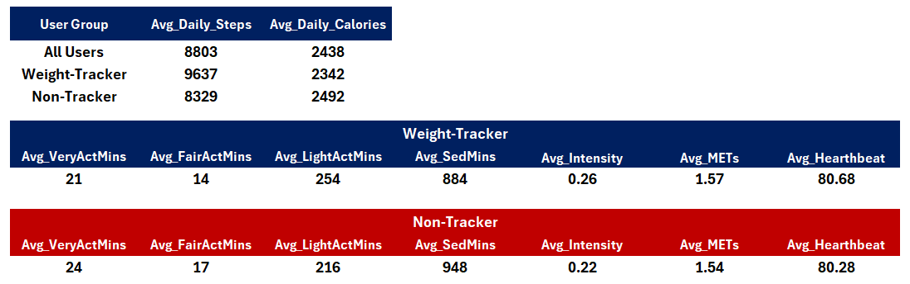
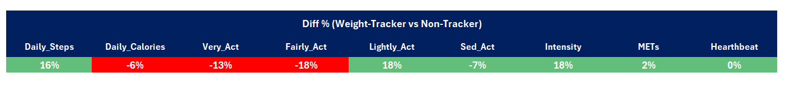
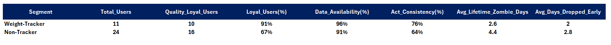
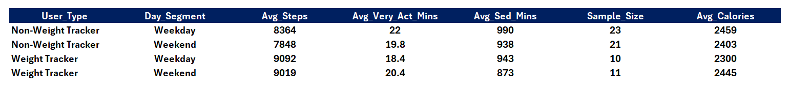
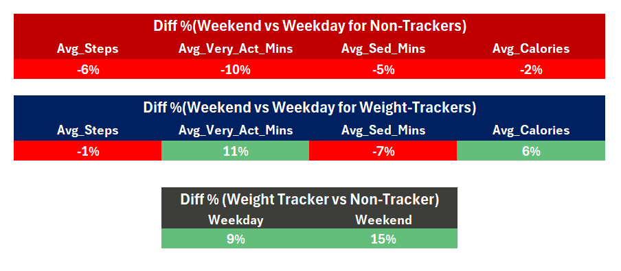
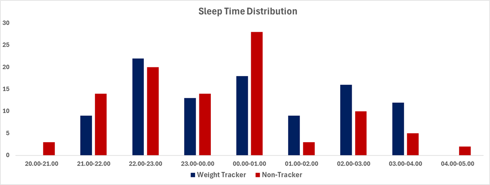
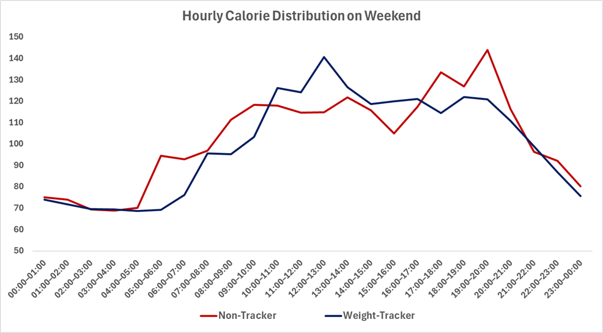
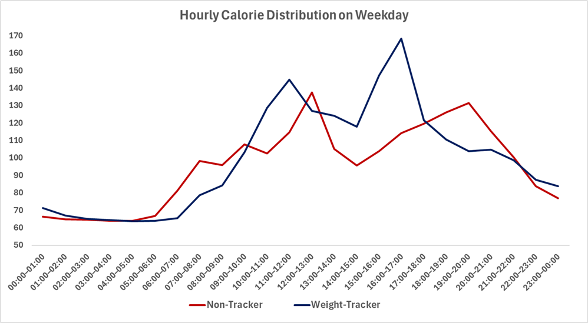
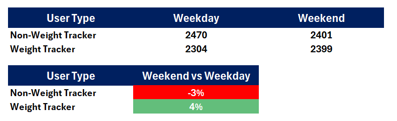

# 🌿 Bellabeat Smart Device Analysis
### Google Data Analytics Capstone Project

---

## 📋 Table of Contents
- [Phase 1 — Ask](#-phase-1-ask)
- [Phase 2 — Prepare](#️-phase-2-prepare)
- [Phase 3 — Process](#️-phase-3-process)
- [Phase 4 — Analyze](#-phase-4-analyze)
- [Phase 5 — Share](#-phase-5-share)
- [Phase 6 — Act](#-phase-6-act)

---

# 🎯 Phase 1: Ask

> This phase defines the business problem, identifies the stakeholders, and establishes the analytical direction for the project.

## 1.1 Summary of the Business Task

Bellabeat is a high-tech company that manufactures health-focused smart products for women. The company's co-founder and Chief Creative Officer, Urška Sršen, believes that analyzing smart device fitness data could unlock new growth opportunities. The goal of this analysis is to examine how consumers use non-Bellabeat smart devices in order to identify behavioral trends that can be applied to one of Bellabeat's products and inform the company's marketing strategy.

**Key Business Questions:**
- 💡 What are some trends in smart device usage?
- 💡 How could these trends apply to Bellabeat customers?
- 💡 How could these trends help influence Bellabeat's marketing strategy?

## 1.2 Key Stakeholders

| Stakeholder | Role |
|---|---|
| Urška Sršen | Co-founder & Chief Creative Officer — Primary sponsor |
| Sando Mur | Co-founder & Mathematician — Key executive |
| Bellabeat Marketing Analytics Team | Will act on findings and recommendations |

---

# 🗂️ Phase 2: Prepare

> This phase covers data sourcing, storage, organization, credibility assessment, and ethical considerations.

## 2.1 Data Source

| Field | Detail |
|---|---|
| Dataset | FitBit Fitness Tracker Data (CC0 Public Domain, Kaggle, submitted by Mobius) |
| Content | Personal fitness tracker data from 33 Fitbit users |
| Metrics | Physical activity, heart rate, sleep monitoring |
| Format | 11 CSV files in long and wide formats |

## 2.2 Data Storage

The dataset was uploaded to Google BigQuery under a dedicated project (`capstone-project-475109`), organized within a dataset named `Fitabase_Data`. All 11 CSV files were stored as individual tables, enabling SQL-based querying and cross-table analysis at scale.

## 2.3 Data Organization

The dataset contains both long and wide format tables. The Daily Activity table is structured in **wide format**, with each row representing a single user-day and multiple metrics captured as separate columns. The minute-level and hourly tables (e.g., Minute_Sleep, Hourly_Calories, Heartrate_Seconds) are structured in **long format**, with each row representing a single time-stamped observation per user.

## 2.4 Credibility Assessment — ROCCC Framework

| Dimension | Rating | Assessment |
|---|---|---|
| Reliable | ⚠️ Low | Sample size of 33 users is insufficient for statistically significant conclusions. Results should be treated as directional. |
| Original | ✅ Yes | Data collected directly from Fitbit devices via Amazon Mechanical Turk survey. First-party dataset. |
| Comprehensive | 🟡 Moderate | Covers steps, calories, heart rate, sleep, and weight. Lacks demographic data (age, gender, location). |
| Current | ⚠️ Low | Collected in 2016. Consumer behavior and device capabilities have evolved significantly since then. |
| Cited | ✅ Yes | Publicly available under CC0 Public Domain license via Kaggle, submitted by Mobius. |

## 2.5 Licensing, Privacy & Security

The dataset is released under a **CC0 Public Domain license**, meaning no copyright restrictions apply. All user identifiers are anonymized numeric IDs — no personally identifiable information (PII) is present. Data was stored in a private Google BigQuery project with access restricted to the analyst.

## 2.6 Known Limitations

> ⚠️ **Important:** These limitations should be considered when interpreting all findings in this report.

- **Sample size:** 33 users limits statistical generalizability — findings are directional, not definitive.
- **No demographics:** Absence of gender/age data prevents direct confirmation of user profile hypotheses.
- **Data age:** Collected in 2016 — may not fully reflect current consumer behavior.

---

# ⚙️ Phase 3: Process

> This phase documents all data cleaning, transformation, and validation steps performed to ensure data integrity prior to analysis.

## 3.1 Tool Selection

**Google BigQuery (SQL)** was selected as the primary processing tool due to the scale and granularity of the dataset. Minute-level tables contain millions of rows, making a spreadsheet-based approach impractical for data processing. BigQuery's SQL environment enables reproducible, auditable transformations through views, which also serve as living documentation of the cleaning logic applied to each table.

**Microsoft Excel** was used as the visualization and presentation layer. Once the cleaned views were finalized in BigQuery, aggregated query outputs were exported to Excel for dashboard creation, chart design, and final visual presentation of findings.

## 3.2 Initial Inspection

### 🔍 Duplicate & Collision Audit
A unified audit query was executed across all 11 tables using `UNION ALL`. Total row counts were compared against distinct composite keys — constructed by concatenating `Id` and the relevant timestamp with a **double-ampersand (`&&`) separator** to eliminate collision risk. 

**Result:** Duplicates were isolated exclusively to the `Minute_Sleep` table (**525 records**). All other tables were clean.

### 🔍 Null Value Audit
A column-level null check was performed using `COUNTIF(column IS NULL)` across all relevant fields.

**Result:** Null values were isolated exclusively to the `fat` column in `Weight_Log` (**31 records**). All other fields were complete.

## 3.3 Error Type Checklist

| Error Type | Status | Applied Technique |
|---|---|---|
| Duplicates | ✅ Done | SELECT DISTINCT within CTE (Minute Sleep); cross-table scan for all others |
| Trailing Spaces | ✅ Done | TRIM() applied to Id and all timestamp columns |
| Format Errors | ✅ Done | PARSE_DATETIME() converting string timestamps to DATETIME |
| Null Values | ✅ Done | All columns clean except `fat` in Weight Log (31 nulls) — retained with documentation |
| Logic Errors | ✅ Done | Valid Day filter: ≥2,000 steps, ≥1,200 calories, ≤1,380 sedentary minutes |
| Collision Risk | ✅ Done | Double-ampersand (&&) separator in CONCAT for composite key construction |

## 3.4 Table-Level Cleaning Documentation

<b>📄 Click to expand — All 11 Tables</b>

### 1. Daily Activity Table

- **Validation Thresholds:** Data quality was ensured by establishing a "Valid Day" criteria. Records with fewer than 2,000 steps, less than 1,200 calories, and more than 1,380 sedentary minutes were excluded, as these values typically indicate non-wear time or device sync issues rather than actual user behavior.
- **Null Management:** Verified key metrics (Steps, Calories, Active Minutes) for completeness. No critical null values were found after applying the activity thresholds.
- **Conversion:** ID data converted to STRING for consistent joins across all tables.

### 2. Hourly Calories Table

- **Completeness Check (24-Hour Rule):** Only days with a full 24-hour cycle of recordings were included. This prevented hourly averages from being skewed by days with partial data (e.g., a device being charged for half a day).
- **Relational Integrity:** An INNER JOIN was performed with the cleaned Daily Activity table to ensure hourly analysis only reflects valid activity days.
- **Data Type Correction:** Converted timestamp strings into standardized DATETIME formats to enable precise hourly extraction and time-series analysis.

### 3. Hourly Intensities Table

- **Completeness Check (24-Hour Rule):** Only days with a full 24-hour cycle of recordings were included. This ensured that intensity averages accurately reflect complete daily activity patterns, preventing distortions caused by partial recording days.
- **Relational Integrity:** An INNER JOIN was performed with the cleaned Daily Activity table to guarantee that hourly intensity records correspond exclusively to validated activity days. Any records belonging to days that failed the activity thresholds were automatically excluded.
- **Metric Retention:** Both `Total_Intensity` and `Average_Intensity` fields were preserved — total intensity captures overall exertion volume per hour, while average intensity allows fair comparison across users with different recording frequencies.
- **Data Type Correction:** Converted the `Activity_Hour` timestamp strings into standardized DATETIME formats, with hour-of-day extracted as a separate integer field.

### 4. Hourly Steps Table

- **Completeness Check (24-Hour Rule):** Only days with a full 24-hour cycle of recordings were included to ensure step distributions reflect genuine activity patterns.
- **Relational Integrity:** An INNER JOIN was performed with the cleaned Daily Activity table. Any step records from days that failed the minimum threshold criteria were automatically excluded.
- **Metric Retention:** The `Steps` field was preserved at the hourly grain to enable time-of-day analysis, allowing identification of peak movement windows and sedentary hours.
- **Data Type Correction:** Converted the `Activity_hour` timestamp strings into standardized DATETIME formats, with hour-of-day extracted as a separate integer field.

### 5. Heartrate Seconds Table

- **Completeness Check (Valid Days Only):** Only records belonging to days that passed the Daily Activity validation thresholds were retained. Given second-level granularity, partial days could severely skew resting and peak heart rate calculations.
- **Relational Integrity:** An INNER JOIN was performed with the cleaned Daily Activity table to anchor all heart rate readings to validated activity days, preventing non-wear readings from contaminating the analysis.
- **Granularity Preservation:** The full `heartrate_time` timestamp was retained at second-level precision to enable fine-grained analyses such as identifying peak heart rate moments and heart rate recovery speed.
- **Dual Time Reference:** Both the full `heartrate_time` field and an extracted `hour_of_day` integer were included to support both granular and hourly aggregations within the same view.
- **Data Type Correction:** Converted the `Time` timestamp strings into standardized DATETIME formats. The `Value` field was renamed to `heart_rate` for readability and semantic clarity.

### 6. Minute Calories Table

- **Completeness Check (Valid Days Only):** Only records belonging to validated activity days were retained. Partial days could introduce disproportionate gaps in caloric burn patterns at minute-level granularity.
- **Relational Integrity:** An INNER JOIN was performed with the cleaned Daily Activity table. Records from days that failed thresholds were automatically excluded.
- **Granularity Aggregation:** The `hour_of_day` field was extracted to enable flexible aggregation supporting both minute-level and hourly caloric burn analyses within the same view.
- **Data Type Correction:** Converted the `Activity_Minute` timestamp strings into standardized DATETIME formats, with `activity_date` and `hour_of_day` derived as separate fields.

### 7. Minute Intensities Table

- **Completeness Check (Valid Days Only):** Only validated activity days were retained. Incomplete days could distort the distribution of low, moderate, and high intensity periods throughout the day.
- **Relational Integrity:** An INNER JOIN was performed with the cleaned Daily Activity table to ensure all minute-level intensity records are tied exclusively to validated days.
- **Metric Retention:** The `Intensity` field was preserved at the minute grain to enable classification of activity levels, identification of sustained high-intensity intervals, and intensity zone transition analysis.
- **Granularity Aggregation:** The `hour_of_day` field was extracted to support both minute-level and hourly intensity summaries.
- **Data Type Correction:** Converted the `Activity_Minute` timestamp strings into standardized DATETIME formats.

### 8. Minute Sleep Table

- **Duplicate Removal:** Unlike other tables, the Minute Sleep table required an explicit deduplication step. A `SELECT DISTINCT` was applied within a CTE (`unique_sleep`) to eliminate the 525 duplicate records identified during the initial audit. This step was performed first to ensure all downstream operations were conducted on a clean, unique dataset.
- **Completeness Check (Valid Days Only):** Only sleep records belonging to validated activity days were retained, enabling meaningful correlations between sleep quality and daily movement behavior.
- **Relational Integrity:** An INNER JOIN was performed with the cleaned Daily Activity table to anchor all minute-level sleep records to validated days.
- **Granularity Preservation:** The full `sleep_time` timestamp was retained at minute-level precision alongside the extracted `hour_of_day` field, supporting both granular analyses (sleep onset and wake-up time detection) and hourly distributions.
- **Metric Retention:** Both `sleep_state` and `logId` fields were preserved. The `sleep_state` field enables sleep stage classification per minute, while `logId` allows individual sleep sessions to be tracked and grouped independently.
- **Data Type Correction:** Converted the `Activity_Minute` timestamp strings into standardized DATETIME formats at the CTE level.

### 9. Minute Steps Table

- **Completeness Check (Valid Days Only):** Only validated activity days were retained. Incomplete days could introduce misleading gaps in movement patterns at minute-level granularity.
- **Relational Integrity:** An INNER JOIN was performed with the cleaned Daily Activity table. Records from days that failed thresholds were automatically excluded.
- **Metric Retention:** The `Steps` field was preserved at the minute grain to enable identification of burst activity periods, sustained walking intervals, and transitions between active and sedentary minutes.
- **Granularity Aggregation:** The `hour_of_day` field was extracted to support both minute-level and hourly step distribution summaries.
- **Data Type Correction:** Converted the `Activity_Minute` timestamp strings into standardized DATETIME formats.

### 10. Weight Log Table

- **User-Level Filtering:** Unlike other tables that join on both `Id` and `activity_date`, the Weight Log table was filtered at the user level only. A `WHERE IN` subquery was applied to retain records belonging to users present in the cleaned Daily Activity table. This approach was preferred because weight measurements are infrequent and may not coincide with a tracked activity day — a date-level INNER JOIN would have unnecessarily eliminated valid weight records.
- **Null Management:** The `fat` column contains 31 null records. Rather than excluding these rows entirely, the field was retained to preserve all other valid metrics (BMI, weight) for those users. Downstream analyses involving the `fat` field should account for its incompleteness accordingly.
- **Metric Retention:** All key body composition fields — `Weight_kg`, `Weight_pounds`, `fat`, `BMI` — were preserved. The `is_manual_report` flag was retained to allow differentiation between automatically synced and manually entered records.
- **Session Tracking:** The `LogId` field was preserved to enable individual weigh-in sessions to be uniquely identified and grouped.
- **Data Type Correction:** Converted the `Date` timestamp strings into standardized DATE formats.

### 11. Minute MET Table

- **Completeness Check (Valid Days Only):** Only validated activity days were retained. Incomplete days could significantly distort metabolic intensity profiles at minute-level granularity.
- **Relational Integrity:** An INNER JOIN was performed with the cleaned Daily Activity table to ensure all minute-level MET records are tied to validated days.
- **Metric Retention:** The `METs` field was preserved at the minute grain. MET values provide a standardized, body-weight-independent measure of energy expenditure, making this table particularly valuable for comparing activity intensity across users with different physical profiles.
- **Granularity Aggregation:** The `hour_of_day` field was extracted to support both minute-level and hourly metabolic intensity summaries.
- **Data Type Correction:** Converted the `Activity_Minute` timestamp strings into standardized DATETIME formats.

---

---

# 🔬 Phase 4: Analyze

> This phase documents the analytical approach, key findings, trends, and how the insights connect to the original business questions.

**❓ How should you organize your data to perform analysis on it?**

Data was organized into two behavioral segments: **Weight-Trackers** (users who logged their weight at least once) and **Non-Trackers** (users who did not). This segmentation served as the analytical backbone across all six analyses.

**❓ Has your data been properly formatted?**

Yes. All 11 tables were cleaned and standardized into BigQuery views prior to analysis. Timestamp strings converted, IDs cast to STRING, duplicates removed, and logic-based filters applied to exclude non-wear days.

**❓ What surprises did you discover in the data?**

> 💡 **Key Surprise #1:** Weight-tracking days produce no meaningfully higher activity levels than regular days for the same users. Weight tracking is a **symptom** of a disciplined lifestyle — not a cause of it.

> 💡 **Key Surprise #2:** Weight-Trackers experience **24% fewer disturbed sleep minutes** despite going to bed later — their sleep architecture is more efficient, not just longer.

**❓ What trends or relationships did you find in the data?**

Three consistent patterns emerged across all six analyses:

| # | Pattern | Finding |
|---|---|---|
| 1 | **Behavioral Consistency** | Weight-Trackers stable across weekdays, weekends, and weigh-in days. Non-Trackers show 6% step drop and 10% Very Active Minutes decline on weekends. |
| 2 | **Structured Daily Rhythm** | Weight-Trackers peak 15:00–17:00 (planned workouts). Non-Trackers peak 18:00–20:00 (reactive, post-work bursts). |
| 3 | **Long-Term Engagement** | 91% loyalty vs 67%, 12-point higher activity consistency, 1.8 fewer zombie days. |

**❓ How will these insights help answer your business questions?**

These trends reveal **who** the high-engagement user is (disciplined, routine-driven, likely female), **how** they use their device (behavioral anchor, not motivational spike tool), and **what** differentiates them — giving Bellabeat a clear profile to target and message to communicate.

---

# 📊 Phase 5: Share

> Key findings organized into three thematic areas, each supported by analyses, visualizations, and conclusions.

---

## 🏷️ Theme 1 — The Disciplined User Profile

---

### 📈 Analysis 1: General Overview

#### Key Metrics

| Metric | Weight-Tracker | Non-Tracker | Diff |
|---|---|---|---|
| Avg Daily Steps | 9,637 | 8,329 | **+16% ✅** |
| Avg Daily Calories | 2,342 | 2,492 | **-6% 🔴** |
| Avg Light Active Mins | 254 | 216 | **+18% ✅** |
| Avg Sedentary Mins | 884 | 948 | **-7% ✅** |
| Avg Intensity | 0.26 | 0.22 | **+18% ✅** |
| Avg Heart Rate | 80.68 | 80.28 | **~0%** |

### 💬 Conclusion

Weight-Trackers walk 16% more steps daily yet burn 6% fewer calories — an apparent contradiction explained by activity type. They spend 18% more time in **light activity** and are 7% less sedentary, achieving more through sustained low-intensity movement rather than intense bursts.

Average intensity is 18% higher (0.26 vs 0.22), confirming more consistent daily engagement. Heart rate is nearly identical, suggesting comparable cardiovascular baselines.

Given that males have a 20–30% higher basal metabolic rate than females, the higher caloric burn in the Non-Tracker group is consistent with a male-dominant composition. This supports the hypothesis that the **Weight-Tracker group is predominantly female** — Bellabeat's core audience.

---

### 📈 Analysis 2: Weight-Logged Day vs Typical Day

#### Key Metrics

| Metric | Typical Day | Weight-Logged Day | Diff |
|---|---|---|---|
| Avg Steps | 8,823 | 8,265 | **0%** |
| Avg Calories | 2,457 | 2,271 | **-6% 🔴** |
| Avg Sedentary Mins | 935.7 | 936.4 | **0%** |
| Avg Fairly Active Mins | 11.8 | 11.1 | **0%** |
| Avg Very Active Mins | 20.8 | 15.1 | **-6% 🔴** |

### 💬 Conclusion

Weight tracking does **not** function as a daily motivational trigger. Activity on weight-logging days is virtually identical to normal days — 0% difference in steps, 0% difference in sedentary minutes, 0% difference in fairly active minutes.

This is a critical finding: **weight tracking is an indicator of a disciplined lifestyle, not a short-term behavioral spike.** These users are consistently active every single day — the act of weighing in does not change their behavior that day.

---

## 🏷️ Theme 2 — Engagement & Retention

---

### 📈 Analysis 3: Device Usage

#### Key Metrics

| Metric | Weight-Tracker | Non-Tracker | Diff |
|---|---|---|---|
| Total Users | 11 | 24 | — |
| Loyalty Rate | **91%** | 67% | **+24 pp ✅** |
| Data Availability | **95.76%** | 90.62% | **+5 pp ✅** |
| Activity Consistency | **75.69%** | 63.55% | **+12 pp ✅** |
| Avg Zombie Days | **2.6** | 4.4 | **-41% ✅** |
| Avg Days Dropped Early | **2** | 2.8 | **-29% ✅** |

### 💬 Conclusion

Weight-Trackers demonstrate stronger engagement and more stable retention across every metric measured.

- **91% loyalty** vs 67% — nearly all Weight-Trackers stay active until the end of the observation period
- **41% fewer zombie days** — Non-Trackers disengage gradually; Weight-Trackers either stay active or churn decisively
- **12-point activity consistency gap** — weight tracking correlates with disciplined, sustained physical activity, not sporadic engagement

Non-Trackers don't quit suddenly — **they fade.** Zombie days are the early warning signal.

---

### 📈 Analysis 4: Weekend vs Weekday Activity

#### Key Metrics

| Metric | WT Weekday | WT Weekend | NT Weekday | NT Weekend |
|---|---|---|---|---|
| Avg Steps | 9,092 | 9,019 | 8,364 | 7,848 |
| Avg Very Active Mins | 18.4 | **20.4 (+11% ✅)** | 22 | **19.8 (-10% 🔴)** |
| Avg Sedentary Mins | 943 | **873 (-7% ✅)** | 990 | **938 (-5% 🔴)** |
| Avg Calories | 2,300 | **2,445 (+6% ✅)** | 2,459 | **2,403 (-2% 🔴)** |

### 💬 Conclusion

**The Consistency Advantage:** Weight-Trackers increase Very Active Minutes by **+11%** and burn **+6%** more calories on weekends. Weekends are an opportunity for active engagement, not behavioral decline.

**The Weekend Slump:** Non-Trackers drop **-6% in steps** and **-10% in Very Active Minutes** on weekends. The gap between segments widens: Weight-Trackers outperform by 9% on weekdays and **15% on weekends**.

**The Shared Positive:** Both segments reduce sedentary time on weekends — users across both groups are more physically mobile and less desk-bound on their days off.

---

## 🏷️ Theme 3 — Rhythm & Recovery

---

### 📈 Analysis 5: Sleep Distribution & Efficiency

### 💬 Conclusion

Weight-Trackers tend to sleep **later** than Non-Trackers. Non-Trackers cluster around the 00:00–01:00 window; Weight-Trackers are more spread across late-night hours with notable presence in the 02:00–04:00 range.

Despite sleeping later, Weight-Trackers achieve significantly better sleep quality:
- **24% fewer disturbed sleep minutes**
- **7% more actual sleep time** relative to time in bed

Their sleep architecture is more efficient — they fall asleep faster and stay asleep longer once in bed.

⚠️ **Both groups sleep below the recommended 8 hours** — an underserved wellness need that Bellabeat is well-positioned to address.

---

### 📈 Analysis 6: Calorie Spent Distribution

#### Key Metrics

| Metric | Weight-Tracker | Non-Tracker |
|---|---|---|
| Weekend vs Weekday Calories | **+4% ✅** | -3% 🔴 |
| Weekday Peak Hour | **15:00–17:00** (planned) | 11:00–12:00 & 18:00–20:00 (reactive) |
| Curve Volatility | **Low — smooth** | High — sharp spikes |

### 💬 Conclusion

**Weekend Discipline:** Weight-Trackers increase caloric expenditure **+4%** on weekends; Non-Trackers drop **-3%**.

**Structured vs Reactive (Weekday):** Weight-Trackers peak sharply at **15:00–17:00** (~170 cal/hour) — consistent with planned workouts. Non-Trackers show reactive evening spikes at **18:00–20:00**, suggesting post-work compensatory activity.

**Weekend Convergence:** On weekends, the gap narrows. Both groups show elevated mid-day activity, but Weight-Trackers maintain smoother transitions while Non-Trackers spike sharply in the late evening.

**Core Differentiator:** Weight tracking functions as a **behavioral anchor** — not increasing total activity at every hour, but strongly correlating with temporal consistency and planned energy expenditure throughout the day.

---

# 🚀 Phase 6: Act

> This phase translates analytical findings into concrete marketing recommendations for Bellabeat.

## 6.1 High-Level Recommendations

---

### 💡 Recommendation 1 — Reframe the Core Value Proposition

The data shows Bellabeat's highest-value users are **not motivated by gamification or daily nudges**. They are routine-driven individuals who use their device as a behavioral anchor.

> **Strategic Shift:** From *"track your progress"* → *"support your structure"*

Position Bellabeat as a **lifestyle companion for disciplined, health-conscious women** rather than a motivational tool for beginners.

---

### 💡 Recommendation 2 — Build a Weekend Engagement Campaign

Non-Trackers show a measurable weekend drop-off: **-6% steps, -10% Very Active Minutes**. Bellabeat can target this segment with weekend-specific push notifications, challenges, or content.

> **Example messages:** *"Your weekend movement goal"* · *"Saturday active minutes"*

**Goal:** Close the 15% activity gap observed between segments on weekends.

---

### 💡 Recommendation 3 — Introduce a Sleep Quality Feature or Campaign

Both segments sleep below the recommended 8 hours. Non-Trackers experience significantly more sleep disruption. This is an **underserved need**.

> **Feature Idea:** A **Sleep Quality Score** combining time in bed, actual sleep minutes, and disturbed minutes into a single metric.
>
> **Campaign Message:** *"Rest is part of the routine."*

---

### 💡 Recommendation 4 — Use Zombie Day Detection as a Retention Trigger

Non-Trackers accumulate **4.4 zombie days** vs 2.6 for Weight-Trackers. Detecting consecutive zombie days and triggering a personalized intervention can prevent full disengagement before it happens.

> **Intervention options:** Motivational message · Simplified daily goal · Check-in prompt

---

### 💡 Recommendation 5 — Target Weight-Tracker Profile for Premium Upsell

Weight-Trackers have **91% loyalty**, higher data continuity, and consistent engagement across all six analyses. This is Bellabeat's highest-retention segment.

> **Target this profile for:** Subscription tier · Stress monitoring · Menstrual cycle integration · Advanced health features

---

## 6.2 Next Steps for Stakeholders

> ⚠️ **Priority Action:** Validate the gender hypothesis. The assumption that Weight-Trackers are predominantly female is inference-based (drawn from BMR patterns). **Collecting gender data through app onboarding** would allow Bellabeat to confirm this segmentation and build more precisely targeted campaigns.

Additionally, expanding the dataset beyond 33 users and updating it beyond 2016 would significantly strengthen confidence before committing marketing budget to any recommendation above.

## 6.3 Additional Data That Could Expand These Findings

| Data Type | Value |
|---|---|
| Demographic data (gender, age, location) | Validate female-skew hypothesis; enable granular segmentation |
| In-app engagement data | Complement behavioral patterns with product usage data |
| Longitudinal multi-year data | Assess seasonal stability of Weight-Tracker behavior |
| Bellabeat user data | Directly compare against FitBit findings; assess transferability |

## 👤 Author

**[Kerim Mert Halıcı]**  
Google Data Analytics Certificate — Capstone Project  
[LinkedIn](https://www.linkedin.com/in/kmerthalici/) · [GitHub](https://github.com/Merthlc)
